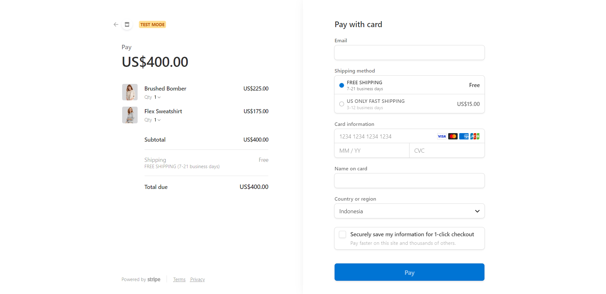

# Full Stack E-Commerce Clothing Website
This project is a full stack e-commerce website built with Next js. I created this project as an exercise to develop my web development skills, especially to learn about Next js.

## Table of contents

- [Overview](#overview)
  - [The challenge](#the-challenge)
  - [Screenshot](#screenshot)
  - [Links](#links)
  - [Credit](#credit)
- [My process](#my-process)
  - [Built with](#built-with)
  - [What I learned](#what-i-learned)
  - [Continued development](#continued-development)
  - [Useful resources](#useful-resources)
- [Acknowledgments](#acknowledgments)
- [Author](#author)
- [Getting Started](#getting-started)


## 🚨 Overview

### The challenge

- Build out the project to the designs provided
- Implementing cart functionality 
- Connecting to Sanity as back end database for e-commerce
- Connecting Stripe APIs to power online payment processing for e-commerce

### Screenshot

For now the search bar is only for styling purposes and doesn't work properly yet

### Links
The live site is deployed in vercel, but it seems that vercel can't render swiper js. In the meantime i'm still trying to find a solution
- [Live Site URL](https://full-stack-ecommerce-clothing-web-main-85mxzemdt.vercel.app/)

### Credit
[Figma Web Design & UI kit i used for this project is design by Weird Design Studio](https://ui8.net/ui-market/products/e-commerce-ui-website-design?status=7)

## ⚙️ My process

### Built with

- Semantic HTML5 markup
- CSS custom properties
- Flexbox
- CSS Grid
- [Next JS](https://nextjs.org/) - React Framework for Production
- [Sanity](https://www.sanity.io/) - Sanity is a customizable solution that treats content as data to power digital business.
- [Stripe](https://stripe.com/en-gb-us) - APIs to power online payment processing for e-commerce
- [react-hot-toast](https://react-hot-toast.com/) - react library that adds beautiful notifications to our react application. 
- [react icons](https://react-icons.github.io/react-icons/) - JS library to add icons
- [swiper js](https://swiperjs.com/) - JS library to add slider component
- [canvas-confetti](https://www.npmjs.com/package/canvas-confetti) - Lightweight JS plugin to create a confetti celebration explosion effect. It draws confetti graphics on the HTML canvas element. 

### What I learned

I learned a simple css styling to put text in a background as shown below
```js
.newsletter-background {
  font-weight: 800;
  font-size: 7.5rem;
  line-height: 151px;
  color: #f2f3f7;
  position: absolute;
  z-index: -1;
}
```
By setting position to absolute and z-index to -1 (or lower than any other z-index of other elements).
z-index is a CSS property that defines the order of overlapping HTML elements. Elements with a higher index will be placed on top of elements with a lower index


I also learned how to connect stripe as payment gate for e-commerce. Full code for connecting to stripe in /pages/api/stripe.js


The confetti effect is implemented on the payment success page after the user successfully checkouts their cart


### Continued development
The development of this project can be continued by adding a search filter functionality, an e-commerce newsletter, activate the slider function for product section in homepage. In the near future, I'm going to explore react js search filters and maybe add that functionality myself.

### Useful resources
- [UI/UX Design Resources](https://ui8.net/) - This website provide many UI/UX design, some are even free.
- [Tutorial Modern Full Stack ECommerce React Application with Stripe by JavaScript Mastery](https://www.youtube.com/watch?v=4mOkFXyxfsU&t=10459s) - This youtube tutorial really helps in understanding Next js and the use of sanity and stripe for e-commerce
- [Swiper React Components](https://swiperjs.com/react#styles)
- [Customize Prev/Next Button of Swiper Arrows](https://www.timo-ernst.net/blog/2020/09/12/arrows-in-react-swiper-js-how-to-customize-prev-next-button/)


```
